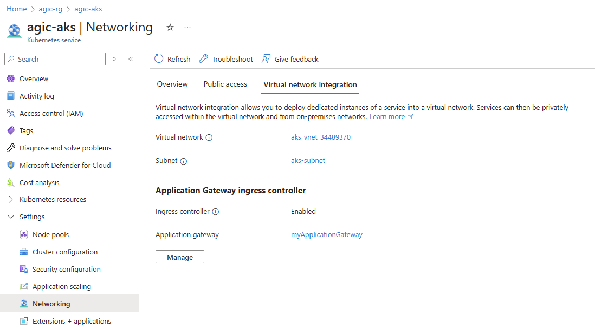

# Application Gateway Ingress Controller

https://learn.microsoft.com/en-us/azure/application-gateway/tutorial-ingress-controller-add-on-existing

## Steps

```
task azure_auth
task new_aks_cluster
task new_application_gateway
task associate_application_gateway_to_aks
task peer_vnets
task aks_get_credentials
``` 

### Application Gateway Ingress Controller Associated to AKS
