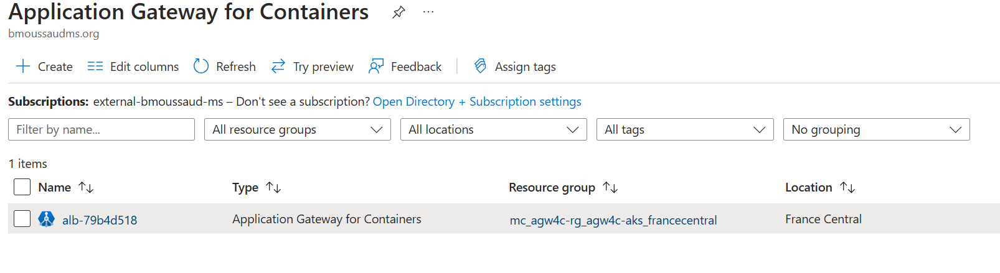
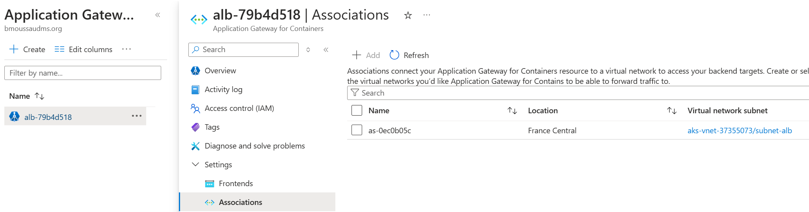
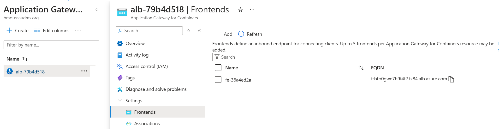

# Application Gateway For Container

https://learn.microsoft.com/en-us/azure/application-gateway/for-containers/

Application Gateway for Containers is an application layer (layer 7) load balancing and dynamic traffic management product for workloads running in a Kubernetes cluster. It extends Azure's Application Load Balancing portfolio and is a new offering under the Application Gateway product family.

Application Gateway for Containers is the evolution of the Application Gateway Ingress Controller (AGIC), a Kubernetes application that enables Azure Kubernetes Service (AKS) customers to use Azure's native Application Gateway application load-balancer. In its current form, AGIC monitors a subset of Kubernetes Resources for changes and applies them to the Application Gateway, utilizing Azure Resource Manager (ARM).


## Deploy Application Gateway for Containers ALB Controller

https://learn.microsoft.com/en-us/azure/application-gateway/for-containers/quickstart-deploy-application-gateway-for-containers-alb-controller?tabs=install-helm-windows

Deploy a brand new AKS Cluster and configure the ALB Controller. An Application Gateway for Containers *ALB Controller* is a Kubernetes deployment that orchestrates configuration and deployment of Application Gateway for Containers by watching Kubernetes both Custom Resources and Resource configurations, such as, but not limited to, Ingress, Gateway, and ApplicationLoadBalancer. It uses both ARM / Application Gateway for Containers configuration APIs to propagate configuration to the Application Gateway for Containers Azure deployment. 

```
task azure_auth
task new_aks_cluster
task azure_alb_identity
task deploy_alb_controller
task verify_alb_controller
``` 

The output of the verify task should be something like this

```
 $ task verify_alb_controller
task: [aks_get_credentials] az aks get-credentials --resource-group $RG --name agw4c-aks
Merged "agw4c-aks" as current context in /home/vscode/.kube/config
...
task: [verify_alb_controller] kubectl get pods -n azure-alb-system-controller
NAME                                        READY   STATUS    RESTARTS   AGE
alb-controller-554cb56cdd-hqlv7             1/1     Running   0          73s
alb-controller-554cb56cdd-tvhrx             1/1     Running   0          73s
alb-controller-bootstrap-659d6567cb-8dzqp   1/1     Running   0          73s
task: [verify_alb_controller] kubectl get gatewayclass azure-alb-external -o yaml
apiVersion: gateway.networking.k8s.io/v1
kind: GatewayClass
metadata:
  creationTimestamp: "2024-12-31T07:58:28Z"
  generation: 1
  name: azure-alb-external
  resourceVersion: "2499"
  uid: 0068c8cb-c22c-477f-8e02-33274ae863d5
spec:
  controllerName: alb.networking.azure.io/alb-controller
status:
  conditions:
  - lastTransitionTime: "2024-12-31T07:58:40Z"
    message: Valid GatewayClass
    observedGeneration: 1
    reason: Accepted
    status: "True"
    type: Accepted
```

## Application Gateway for Containers managed by ALB Controller

https://learn.microsoft.com/en-us/azure/application-gateway/for-containers/quickstart-create-application-gateway-for-containers-managed-by-alb-controller?tabs=new-subnet-aks-vnet


```
task new_subnet_and_delegate_identity
task deploy_application_loabalancer
task deploy_application
task connect_application
```

The test is a success is the output looks like this, with a new header (`AGC-Header-Add`)
````
{
 "path": "/",
 "host": "contoso.com",
 "method": "GET",
 "proto": "HTTP/1.1",
 "headers": {
  "Accept": [
   "*/*"
  ],
  "Agc-Header-Add": [
   "AGC-value"
  ],
  "User-Agent": [
   "rewritten-user-agent"
  ],
  "X-Forwarded-For": [
   "88.121.146.30"
  ],
  "X-Forwarded-Proto": [
   "http"
  ],
  "X-Request-Id": [
   "7c2f5012-ac0d-4faf-93ad-350f81ac4c2d"
  ]
 },
 "namespace": "test-infra",
 "ingress": "",
 "service": "",
 "pod": "backend-v1-56d99ddb49-lgjb2"
}
````                                       

### ApplicationLoadBalancer Example:

```
apiVersion: alb.networking.azure.io/v1
kind: ApplicationLoadBalancer
metadata:
  name: alb-test
  namespace: alb-test-infra
spec:
  associations:
  - /subscriptions/9479b396-5d3e-467a-b89f-ba8400aeb7dd/resourceGroups/MC_agw4c-rg_agw4c-aks_francecentral/providers/Microsoft.Network/virtualNetworks/aks-vnet-37355073/subnets/subnet-alb`
```

### Application Gateway 4 Container
Created once the `ApplicationLoadBalancer` CRD deloyed in the AKS cluster.


### Application Gateway 4 Container Association
Created once the `ApplicationLoadBalancer` CRD deloyed in the AKS cluster, it shows the association with the alb vnet



### Application Gateway 4 Container Frontend
Created once the `Ingress` ot `Gateway` CRD deloyed in the AKS cluster

**Warning**: *Application Gateway for Containers cannot have more than 5 Frontends*

